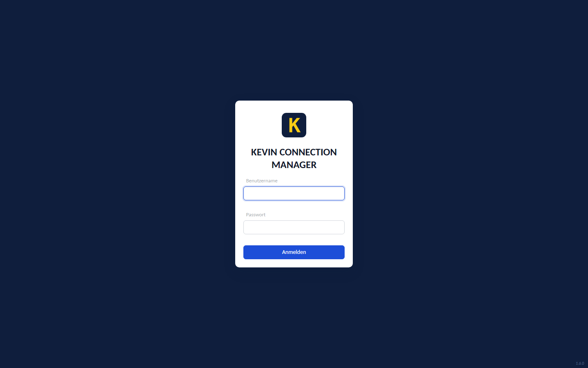
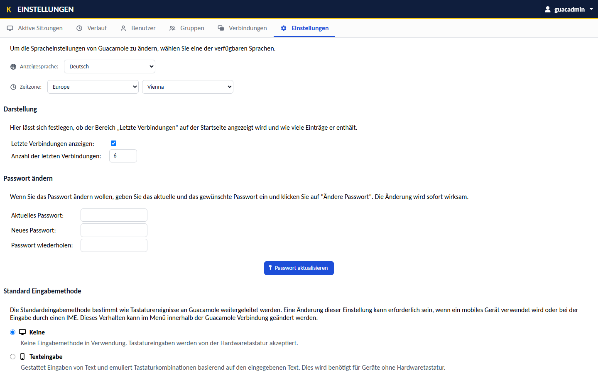
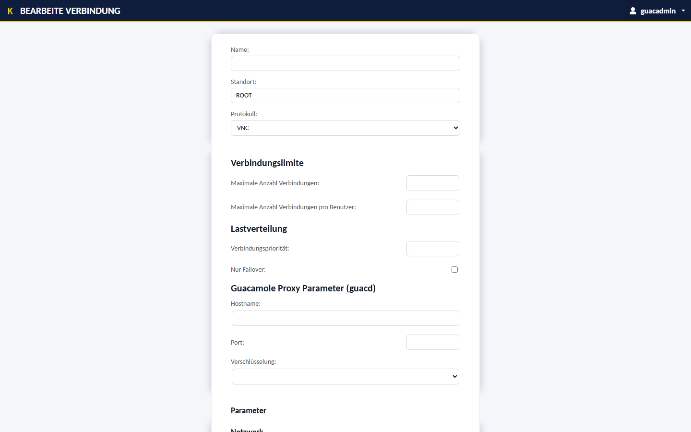
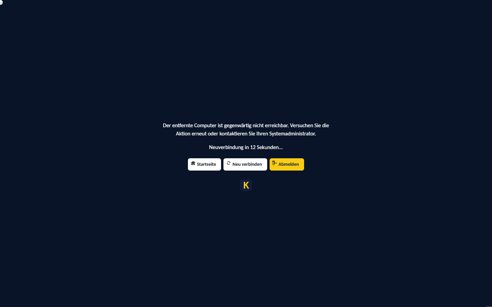

# Kevin Connection Manager

[](https://github.com/keco216/kevin-connection-manager/actions/workflows/build-image.yml)

Selbst gehostetes Remote-Desktop-Gateway (RDP · SSH · VNC) auf Basis von
[Apache Guacamole](https://guacamole.apache.org/) 1.6 – Backend und Oberfläche
bleiben das unveränderte Original, das komplette Erscheinungsbild kommt als
aufsteckbare Extension. **Kein Fork, keine Image-Modifikation.**

| Anmeldung | Einstellungen |
|---|---|
|  |  |

| Verbindungs-Editor | Sitzungs-Dialoge |
|---|---|
|  |  |

## Merkmale

- **Guacamole 1.6.0 unverändert** – Remote-Desktop im Browser ohne Client-Installation
- **Theme-Extension** – Login, Navigation, Formulare, Dialoge, Bildschirmtastatur
  und Icons aus einem Guss; Oberfläche auf Deutsch und Englisch
- **Eingebettete Schrift** – IBM Plex wird aus der Extension ausgeliefert,
  keine externen Abhängigkeiten zur Laufzeit
- **Fertiges Image** – `ghcr.io/keco216/kcm-guacamole`, gebaut per GitHub Action
- **Deployment-fertig** – Compose-Stack für die Entwicklung, Portainer-Stack für den Server

## Schnellstart (Docker Compose)

```powershell
.\scripts\init-db.ps1            # DB-Schema erzeugen (einmalig)
Copy-Item .env.example .env      # POSTGRES_PASSWORD setzen
docker compose up -d
```

Anschließend <http://localhost/> öffnen und mit `guacadmin / guacadmin`
anmelden – das Passwort direkt unter *Einstellungen → Benutzer* ändern.

## Server-Deployment (Portainer)

Stack aus [`deploy/docker-compose.portainer.yml`](deploy/docker-compose.portainer.yml)
anlegen und die Stack-Umgebungsvariable `POSTGRES_PASSWORD` setzen. Guacamole
lauscht auf **Port 7070**; davor gehört ein Reverse-Proxy mit TLS und
WebSocket-Unterstützung. Das Image enthält die Extension bereits – bei jeder
Änderung an `guacamole-home/` oder `Dockerfile` baut die GitHub Action es neu.

## Anpassen

Die Quellen der Extension liegen unter [`branding/src/`](branding/)
(CSS, SVGs, Schriften, Übersetzungen, HTML-Patches). Build-Anleitung und
Implementierungsdetails: [`branding/README.md`](branding/README.md).
Die fertig gebaute Extension liegt jedem
[Release](https://github.com/keco216/kevin-connection-manager/releases) als
`.jar` bei – für den Einsatz in einem bestehenden Guacamole 1.6.0 genügt es,
sie in dessen `GUACAMOLE_HOME/extensions` abzulegen.
Automatisierte Sichtprüfung gegen den laufenden Stack:
[`scripts/branding-verify.mjs`](scripts/branding-verify.mjs) (Playwright).

## Architektur

```
Browser ──► Reverse-Proxy (TLS) ──► Guacamole-Webapp + Branding-Extension
                                      ├── PostgreSQL  (Benutzer, Verbindungen, Verlauf)
                                      └── guacd ─────► Zielsysteme (RDP / SSH / VNC)
```

## Troubleshooting

| Problem | Lösung |
|---|---|
| „Zu viele fehlgeschlagene Anmeldeversuche" | Brute-Force-Schutz (5 Fehlversuche → 5 min Sperre). `docker compose restart guacamole` hebt sie sofort auf. |
| Login schlägt fehl, Logs melden fehlende Tabellen | Schema fehlte beim ersten Start: `docker compose down -v`, danach Schnellstart wiederholen. |

---

Apache Guacamole ist ein Projekt der Apache Software Foundation und bleibt in
diesem Projekt unverändert. Die eingebettete Schrift IBM Plex steht unter der
SIL Open Font License 1.1.
